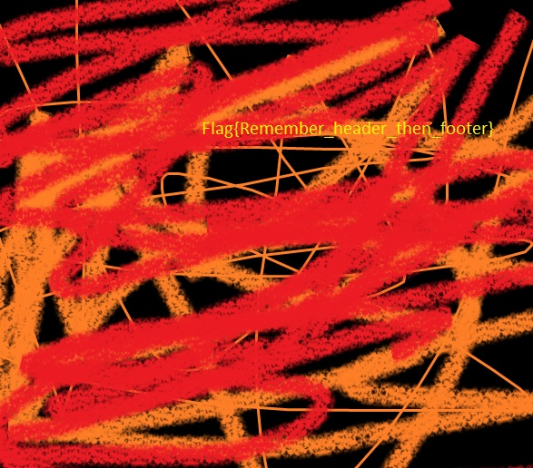

To begin, we will open the file in [CyberChef](https://gchq.github.io/CyberChef/) and conduct a search for embedded files.  
The settings employed are detailed [here](https://gchq.github.io/CyberChef/#recipe=Extract_Files(true,false,false,false,false,false,false,true,150000)).  

This process will allow us to extract the embedded image file.  

Upon examination, the flag is revealed as: `Flag{Remember_header_then_footer}`