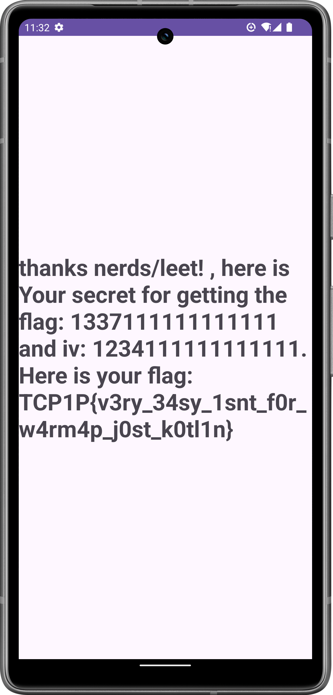

To begin, let's open the `apk` file in `jadx-gui` using the following command:
```bash
jadx-gui alex_app.apk
```

There are two methods to solve this challenge:
1. **Using Online AES Decryption** - [Devglan](https://www.devglan.com/online-tools/aes-encryption-decryption)

2. **Using Credentials**  
    When signing up, use the following credentials to obtain the flag:
    ```
    Username: 1337
    Password: password
    ```
    These credentials can be obtained in various ways; for example, checking the shared preferences.
    
    Additionally, reviewing the logcat will reveal the password.

The flag is: `TCP1P{v3ry_34sy_1snt_f0r_w4rm4p_j0st_k0tl1n}`