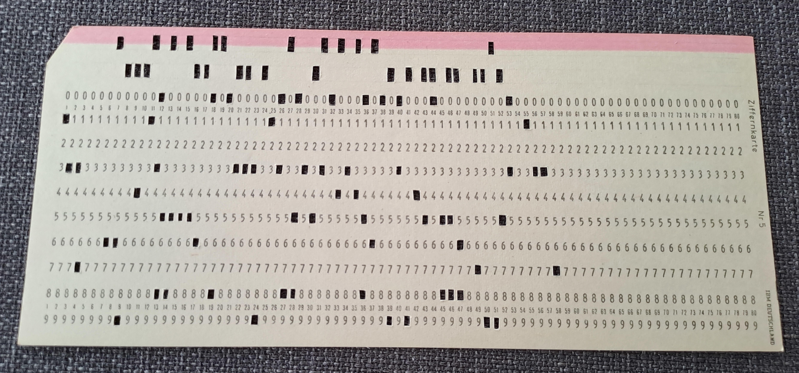

# Ancient Paper

## Description
```
I found this ancient artifact stuck in an old machine labeled "29". But what is its purpose?
```


When we look at this, it resembles [The IBM 029 Card Punch](https://twobithistory.org/2018/06/23/ibm-029-card-punch.html).  
While searching for a solution, we couldn't find any method other than replicating it.  
So, we used [masswerk](https://www.masswerk.at/keypunch/) to replicate the card, and we obtained some text.

```
ENO{H0LL3R1TH_3NC0D3D_F0RTR4N}
```